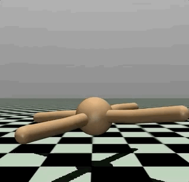
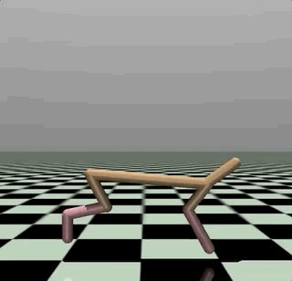
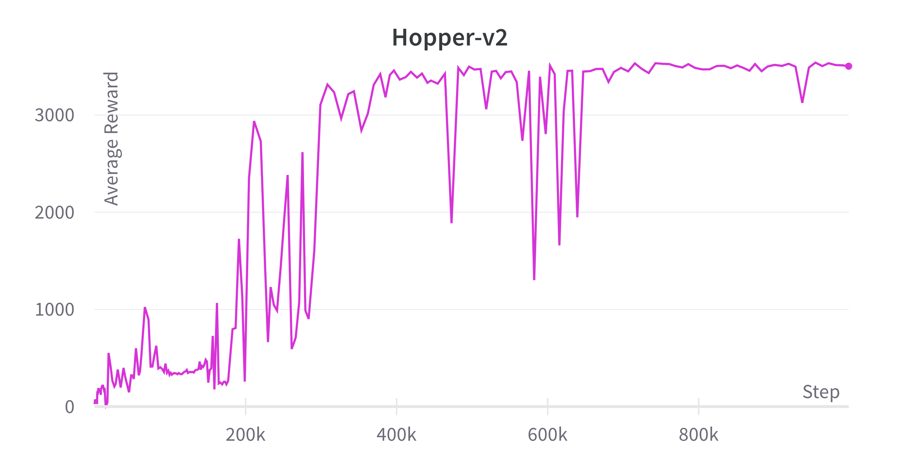
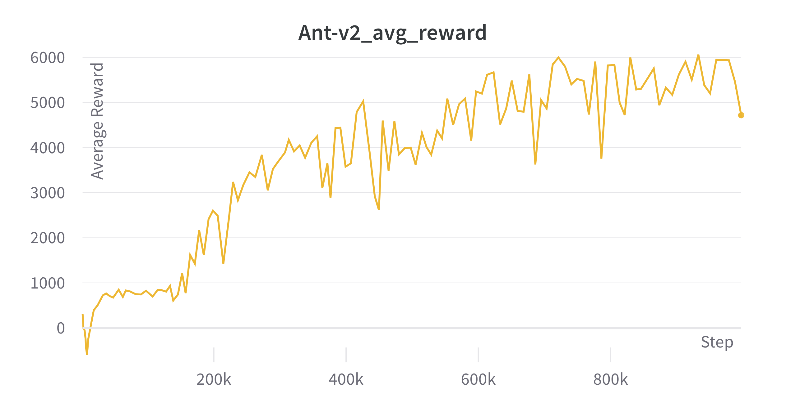
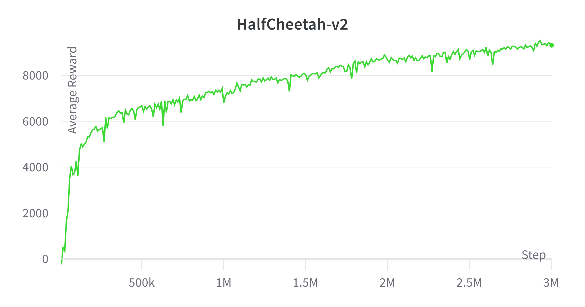
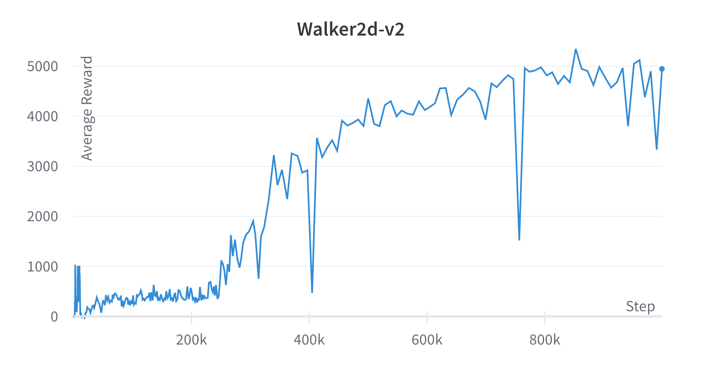
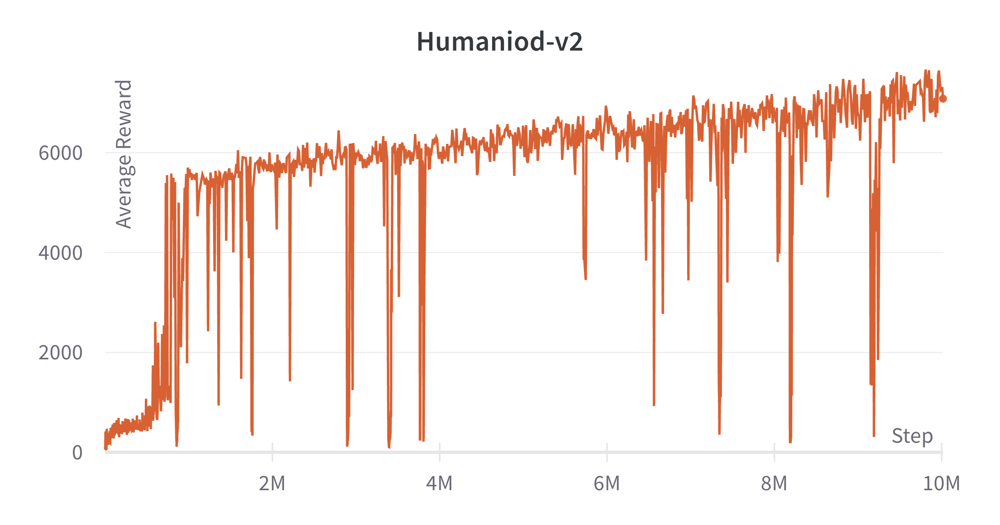

# SAC(Soft Actor Critic) Implementation

This repository is for implementation of [Soft Actor-Critic: Off-Policy Maximum Entropy Deep Reinforcement Learning with a Stochastic Actor](https://arxiv.org/abs/1801.01290).

## Problems that are being tackled

The SAC method tackled 2 problems of model free deep RL methods. 

- First was __sample complexity__. On-policy methods consist of policy gradient formulation and require new samples to be collected for each gradient step. Using off-policy  learning may resolve this problem, but that leads to the second problem.
- Second was __convergence brittleness__. The combination of off-policy learning and high-dimensional, nonlinear function approximation with neural networks presents a major challenge for stability and convergence, espescially in continuous state and action spaces.

### How these problems are being solved 

SAC algorithm is a deep-RL `Off-Policy Actor-Critic` `Maximum Entropy` algorithm.
- `Off-Policy Actor-Critic`: There is no need to use data generated by only the newest policy. It can use a replay buffer which makes use of data generated by older policies, or even just random data, leading to high sample efficiency.
- `Maximum Entropy`: Maximum entropy formulation provides a substantial improvement in exploration. It improves exploration by aquiring diverse behaviors by acting as randomly as possible, while trying to maximize the reward at the same time. 
    The authors of the paper present a convergence proof for policy iteration in the maximum entropy framework and then introduce a new algorithm based on an approximation to this procedure that can be practically implemented with deep neural networks.


## Usage
### Requirements
- torch==1.8.1+cu101
- python==3.8.12
- [Mujoco](https://github.com/openai/mujoco-py#install-mujoco)

### Files
- `replay_buffer.py`: Defines the replay buffer where the transitions are stored.
- `models.py`: Defines the neural networks for the actore(policy) and the critic(Q-function)
- `sac.py`: Defines the agent and it's algorithm to update the parameters.
- `main.py`: The file to run.

### WANDB usage

Logging was done using [wandb](https://wandb.ai/). In order to use it, you need an account for the website. If you have an account, run the following to install required packages.

```bash
pip install wandb
wandb login
```

### How to run

```bash
usage: main.py [-h] [--env_name ENV_NAME] [--gamma G] [--tau G] [--lr G]
               [--alpha G] [--seed N] [--batch_size N] [--num_step N]
               [--hidden_dim N] [--num_grad_step N]
               [--target_update_interval N] [--start_step N] [--buffer_size N]
               [--cuda] [--wandb] [--wandb_id WANDB_ID]
               [--wandb_project WANDB_PROJECT]
```

### Meaning and default values of important options
- `--env_name`:   Gym environment (default: Hopper-v2)
- `--cuda`: Whether to use CUDA(default: False)
- `--wandb`: Whether use Weight and Bias for logging(default: False)
- `--wandb_id`: ID for wandb account(default: None)
- `--wandb_project`: project name of wandb account(default: None)


When specifying GPU, use the environment variable `CUDA_VISIBLE_DEVICES`
```bash
CUDA_VISIBLE_DEVICES=1,2 python main.py
```
### Code Example

```bash
$ CUDA_VISIBLE_DEVICES=1 python main.py --evn_name HalfCheetah-v2 --cuda --num_step 3000000
```

## Results

### Videos of Learned Agents

  
 
 

### Change of Rewards

</img> </img>
</img> </img>
</img>

